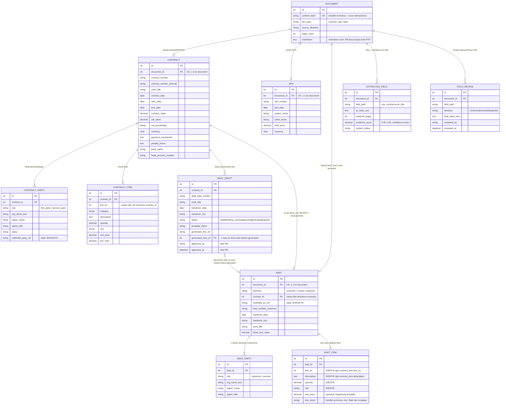

> **Status 2026-10-02 — sebagian tidak berlaku.** Acuan skema yang berlaku adalah
> [`generated/KAMUS_DATA.md`](../generated/KAMUS_DATA.md) (versi `companion-2026.10.2`).
> Dokumen ini ditulis untuk 2026.10.1. Bagian BAST & evidence kini berstatus **usulan
> (ditunda)**, dan "generator" yang dijelaskan di sini (menyalin BoQ dari JSON mentah, mengisi
> nilai bawaan) sudah diganti penyusun yang hanya membaca nilai terverifikasi PM. Dipakai
> sebagai bahan diskusi, bukan spesifikasi.

# Desain ERD & Kamus Data — Automated BAST Document Generator

**Status:** Rancangan untuk disepakati bersama sebelum tabel dibuat di NocoDB.
**Cakupan:** Staging data hasil ekstraksi AI (Kontrak/SPK/PKS + SPH) → verifikasi PM di NocoDB → generate draf BAST otomatis (n8n + Document Templater).
**Dasar:** Dokumen ini **melanjutkan model data yang sudah ada di kode** (`app/companion/model.py`, branch `refactor/audit-2026-09`), bukan rancangan baru dari nol. Lihat catatan di bagian 7 soal status dokumen desain ERD sebelumnya.

---

## 1. Ringkasan Eksekutif

Tujuan sistem: **Automated BAST Document Generator** — bukan sekadar arsip BAST lama, melainkan pipeline yang mengambil data dari **Kontrak/SPK/PKS** dan **SPH**, memverifikasinya bersama PM, lalu men-generate **draf BAST baru** secara otomatis.

Alur data:

1. File PDF Kontrak/SPH masuk lewat RPA (n8n).
2. n8n mengirim file ke backend FastAPI (OCR + LLM, asinkron).
3. FastAPI mengekstrak entitas dan menghitung **confidence score deterministik** (0.00–1.00) per field.
4. FastAPI mengirim callback JSON ke n8n.
5. n8n memasukkan hasil ekstraksi ke tabel-tabel NocoDB di bawah ini.
6. PM membuka NocoDB, memverifikasi nilai per field (Briefing Delivery Ops hlm. 11 & 20: konfirmasi **per field**, status otomatis **tidak** dianggap persetujuan).
7. Setelah disetujui, n8n menarik data terverifikasi dan mencetaknya ke template BAST (.docx) lewat Document Templater.

**Prinsip yang ditegakkan lewat struktur tabel, bukan lewat kedisiplinan coding:**

- **Satu penulis per tabel.** Tabel yang diisi mesin (pipeline) dan tabel yang diisi manusia (PM) dipisah secara fisik. `field_review` tidak pernah ditulis pipeline — bukan konvensi, tapi karena kode pengirim (`nocodb_push.py`) **menolak** payload yang memuat tabel itu.
- **Nilai mentah vs nilai terparse.** Apa adanya di dokumen disimpan di kolom `*_text` (bukti, tidak diubah); hasil parse bertipe tanggal/angka ada di kolom terpisah dan boleh kosong. OCR yang merusak format tanggal tidak membuat barisnya gagal masuk.
- **Hanya nilai ekstraksi + confidence score yang masuk NocoDB** sesuai arahan Kak Leony. Satu tabel di kode saat ini (`extraction_run`) melanggar prinsip ini — diputuskan **dikeluarkan dari cakupan skema NocoDB**, lihat bagian 8.1.

### 1.1 Sebelas Tabel yang Masuk NocoDB, Sekilas

| Tabel | Isi | Ditulis oleh | Kardinalitas thd induk |
|---|---|---|---|
| `document` | Setiap berkas masuk (kontrak/SPH/BAST) | Mesin | Induk tertinggi |
| `contract` | Header Kontrak/SPK/PKS | Mesin | 1:1 ke `document` |
| `contract_party` | Pihak penandatangan kontrak | Mesin | 2 baris per `contract` |
| `contract_item` | Rincian BoQ kontrak — **sumber replikasi** | Mesin | N baris per `contract` |
| `sph` | Header Surat Penawaran Harga | Mesin | 1:1 ke `document` |
| `bast` | Header BAST (historis maupun hasil generate) | Mesin | 1:1 ke `document` |
| `bast_party` | Pihak penyerah/penerima BAST | Mesin | 2 baris per `bast` |
| `bast_item` | Rincian item BAST — **hasil salinan `contract_item`** | Mesin | N baris per `bast` |
| `bast_draft` | Status approval & generate draf | Mesin (baris awal) + **PM** (kolom approval) | N baris per `contract` |
| `extracted_field` | Nilai ekstraksi + confidence score per field | Mesin | N baris per `document` |
| `field_review` | Koreksi manual PM per field | **PM saja** | N baris per `document` |

11 tabel total. `extraction_run` dan `bast_condition` sengaja **tidak** termasuk daftar ini — alasannya di bagian 8.1 dan 8.2.

---

## 2. Diagram ERD

> **Diagram yang berlaku ada di `generated/schema.dbml`** — dibangkitkan dari `model.py`,
> lengkap dengan tipe kolom, UNIQUE, aksi ON DELETE, dan pilihan nilai. Buka di
> dbdiagram.io (lihat README). Diagram Mermaid di bawah adalah ringkasan konseptual
> tulisan tangan; bila keduanya berbeda, yang benar adalah `schema.dbml`.



**Catatan cakupan diagram:** dua tabel di kode (`extraction_run`, `bast_condition`) sengaja tidak dimasukkan di atas — alasannya di bagian 8.1 dan 8.2. Tabel `bast` (beserta `bast_party`/`bast_item`) melayani **dua kebutuhan sekaligus**: (a) menyimpan hasil pembacaan 14 BAST historis yang jadi referensi format, dan (b) menjadi tempat baris item hasil replikasi 1-to-1 saat draf BAST baru dibangun dari kontrak (lihat bagian 6). Satu tabel, dua sumber pengisian, dibedakan lewat `direction`. Kolom `bast_draft.generated_bast_id` adalah **tambahan** terhadap kode saat ini (belum diimplementasikan) — mengunci draf mana yang menghasilkan baris `bast` mana, supaya satu kontrak yang di-generate ulang tidak membuat riwayat PM membingungkan.

---

## 3. Kamus Data — Dokumen Hulu (Kontrak/SPK/PKS)

Tipe NocoDB mengikuti rekomendasi: `SingleLineText`, `LongText`, `Number`, `Date`/`DateTime`, `Currency`, `SingleSelect`, `Percent`. Kolom `id`, `created_at`, `updated_at` dibuat otomatis oleh NocoDB dan tidak perlu ditambah manual.

### 3.1 `document` — ditulis mesin

| Kolom | Tipe NocoDB | Wajib | Keterangan |
|---|---|---|---|
| `content_hash` | SingleLineText | ya | **PK alami / UNIQUE.** sha256 isi berkas — kunci idempotensi; proses ulang dokumen yang sama = UPDATE, bukan baris baru |
| `doc_type` | SingleSelect | ya | pilihan: `contract` / `sph` / `bast` |
| `source_filename` | SingleLineText | ya | nama file PDF asli |
| `page_count` | Number | — | jumlah halaman |
| `markdown` | LongText | — | markdown hasil OCR utuh, agar PM bisa membaca tanpa membuka PDF |

### 3.2 `contract` — ditulis mesin

| Kolom | Tipe NocoDB | Wajib | Keterangan |
|---|---|---|---|
| `document_id` | Number (Link) | ya | **FK** → `document.id`; UNIQUE (1 kontrak = 1 dokumen) |
| `contract_number` | SingleLineText | — | nomor kontrak/SPK/PKS resmi |
| `contract_number_internal` | SingleLineText | — | nomor registrasi internal BUT |
| `work_title` | LongText | ya | judul pengadaan / lingkup pekerjaan |
| `contract_date_text` | SingleLineText | — | tanggal apa adanya di dokumen (bukti) |
| `contract_date` | Date | — | hasil parse; NULL bila gagal parse |
| `start_date_text` / `start_date` | SingleLineText / Date | — | pasangan mentah–terparse, sama prinsipnya |
| `end_date_text` / `end_date` | SingleLineText / Date | — | idem |
| `duration_text` | SingleLineText | — | mis. "30 hari kalender" — **teks**, bukan angka murni |
| `contract_value` | Currency | — | nilai total kontrak (IDR) |
| `subtotal_value` | Currency | — | subtotal sebelum PPN |
| `vat_value` | Currency | — | nilai PPN |
| `vat_percentage` | SingleLineText | — | mis. "11%" — disimpan **teks**, bukan Percent murni, karena redaksi di dokumen bervariasi |
| `currency` | SingleLineText | ya | kode ISO 3 huruf, default `IDR` |
| `payment_mechanism` | LongText | — | mekanisme skema pembayaran |
| `penalty_terms` | LongText | — | mis. "1‰/hari keterlambatan" — **teks**, jangan dipaksa Number |
| `bast_terms` | LongText | — | syarat lampiran wajib BAST |
| `bank_name` / `bank_account_number` / `bank_account_name` | SingleLineText | — | rekening pembayaran |

> Kolom bertanda "teks, bukan angka murni" wajib tetap `SingleLineText`/`LongText` di NocoDB. Pengalaman sebelumnya: NocoDB menebak tipe dari nama kolom, dan kolom bernama numerik yang isinya campur teks (mis. `1/1000`, `30 hari kalender`) gagal masuk tanpa pesan jelas kalau tipenya dipaksa Number.

### 3.3 `contract_party` — ditulis mesin

| Kolom | Tipe NocoDB | Wajib | Keterangan |
|---|---|---|---|
| `contract_id` | Number (Link) | ya | **FK** → `contract.id` |
| `role` | SingleSelect | ya | `first_party` (pemberi kerja/klien) / `second_party` (pelaksana/BUT) |
| `org_name_text` | SingleLineText | ya | nama perusahaan seperti tercetak |
| `signer_name` | SingleLineText | ya | nama penandatangan |
| `signer_title` | SingleLineText | — | jabatan |
| `org_address_text` | LongText | — | alamat |
| `npwp` | SingleLineText | — | |
| `mybhakti_party_ref` | SingleLineText | — | rujukan opak ke data Klien/Vendor di MyBhakti, diisi n8n — **sengaja bukan FK** (data itu milik MyBhakti, bukan milik sistem ini) |
| _(constraint)_ | UNIQUE gabungan | | `contract_id + role` — tepat 2 baris per kontrak |

### 3.4 `contract_item` — ditulis mesin (Tabel Rincian Pekerjaan / BoQ)

| Kolom | Tipe NocoDB | Wajib | Keterangan |
|---|---|---|---|
| `contract_id` | Number (Link) | ya | **FK** → `contract.id` |
| `line_no` | Number | ya | nomor urut **persis seperti di dokumen kontrak** |
| `category` | SingleLineText | — | kategori/kelompok barang-jasa |
| `description` | LongText | ya | uraian barang/jasa/pekerjaan |
| `specification` | LongText | — | spesifikasi teknis |
| `quantity` | Number | — | volume |
| `unit` | SingleLineText | — | satuan |
| `period` | SingleLineText | — | periode/durasi (mis. untuk lisensi tahunan) |
| `unit_price` | Currency | — | harga satuan |
| `line_total` | Currency | — | jumlah harga baris |
| `remarks` | LongText | — | keterangan tambahan |
| _(constraint)_ | UNIQUE gabungan | | `contract_id + line_no` |

Tabel inilah **sumber tunggal** untuk replikasi 1-to-1 ke tabel item BAST — lihat bagian 6.

---

## 4. Kamus Data — SPH, Draf BAST, dan Lapisan Verifikasi

### 4.1 `sph` — ditulis mesin

| Kolom | Tipe NocoDB | Wajib | Keterangan |
|---|---|---|---|
| `document_id` | Number (Link) | ya | **FK** → `document.id`; UNIQUE |
| `sph_number` | SingleLineText | — | nomor Surat Penawaran Harga |
| `sph_date_text` / `sph_date` | SingleLineText / Date | — | pasangan mentah–terparse |
| `project_name` | LongText | — | |
| `client_name` | SingleLineText | — | |
| `total_price` | Currency | — | |
| `currency` | SingleLineText | ya | default `IDR` |

### 4.2 `bast` — inti dokumen BAST (historis maupun hasil generate)

| Kolom | Tipe NocoDB | Wajib | Keterangan |
|---|---|---|---|
| `document_id` | Number (Link) | ya | **FK** → `document.id`; UNIQUE |
| `direction` | SingleSelect | ya | `customer` (BUT→klien) / `vendor` (vendor→BUT) / `unknown` |
| `contract_id` | Number (Link) | — | **FK** → `contract.id`; hanya terisi bila `direction=customer` |
| `mybhakti_po_ref` | SingleLineText | — | opak, diisi n8n — bukan FK |
| `bast_number_customer` / `bast_number_internal` | SingleLineText | — | format Telkom punya dua nomor sekaligus |
| `handover_date_text` / `handover_date` | SingleLineText / Date | — | pasangan mentah–terparse |
| `handover_city` | SingleLineText | — | |
| `work_title` | LongText | ya | |
| `basis_doc_type` | SingleSelect | — | `contract`/`pks`/`spk`/`order_note`/`purchase_order`/`other` |
| `basis_doc_number` / `basis_doc_date` / `basis_doc_value` | SingleLineText / Date / Currency | — | dokumen dasar yang dirujuk BAST |
| `acceptance_statement` | LongText | — | pernyataan penerimaan |

### 4.3 `bast_party` — 2 pihak per BAST

| Kolom | Tipe NocoDB | Wajib | Keterangan |
|---|---|---|---|
| `bast_id` | Number (Link) | ya | **FK** → `bast.id` |
| `role` | SingleSelect | ya | `handover` (penyerah) / `receiver` (penerima) — **bukan** "Pihak Pertama/Kedua": label itu terbalik antar-format dokumen |
| `org_name_text` / `signer_name` / `signer_title` | SingleLineText | nama/jabatan wajib nama | |
| `org_address_text` | LongText | — | |
| `mybhakti_party_ref` | SingleLineText | — | opak, bukan FK |
| _(constraint)_ | UNIQUE gabungan | | `bast_id + role` |

### 4.4 `bast_item` — hasil replikasi BoQ (lihat bagian 6)

| Kolom | Tipe NocoDB | Wajib | Keterangan |
|---|---|---|---|
| `bast_id` | Number (Link) | ya | **FK** → `bast.id` |
| `line_no` | Number | ya | **identik** dengan `contract_item.line_no` sumbernya |
| `description` | LongText | ya | **identik** dengan `contract_item.description` |
| `quantity` / `unit` | Number / SingleLineText | — | **identik** |
| `unit_price` / `line_total` | Currency | — | ikut disalin hanya untuk template yang memuat harga (mis. format Telkom); kosong untuk format kampus/instansi |
| `test_result` | SingleLineText | — | kondisi/status uji terima — **kolom tambahan** yang tidak ada di kontrak, default "Baik dan Lengkap" |
| `remarks` | LongText | — | |
| _(constraint)_ | UNIQUE gabungan | | `bast_id + line_no` |

### 4.5 `bast_draft` — status approval & generate

| Kolom | Tipe NocoDB | Wajib | Keterangan |
|---|---|---|---|
| `contract_id` | Number (Link) | ya | **FK** → `contract.id` |
| `draft_bast_number` | SingleLineText | — | |
| `work_title` | LongText | ya | |
| `handover_date_text` / `handover_date` | SingleLineText / Date | — | |
| `handover_city` | SingleLineText | — | |
| `status` | SingleSelect | ya | `draft` / `pending_review` / `approved` / `generated` / `rejected` — **ini status yang boleh diubah PM**, bukan `system_status` di `extracted_field` |
| `template_name` | SingleSelect | — | `format_telkom` / `format_kampus` / `format_instansi` — menentukan tata letak & apakah harga tampil |
| `acceptance_statement` | LongText | — | |
| `generated_doc_url` | URL | — | link file .docx/.pdf hasil generate |
| `generated_bast_id` | Number (Link) | — | **FK** → `bast.id`, nullable, terisi otomatis saat `status` berubah jadi `generated` |
| `approved_by` | SingleLineText | — | **hanya diisi PM** |
| `approved_at` | DateTime | — | **hanya diisi PM** |

> **Catatan implementasi:** kolom `generated_bast_id` **belum ada** di `app/companion/model.py` saat ini — draf disambungkan ke hasil generate-nya hanya secara implisit lewat `contract_id` yang sama. Ini bagian dari skema yang diusulkan di dokumen ini, perlu ditambahkan ke `model.py` sebelum implementasi NocoDB. Tanpa ini, satu kontrak yang di-generate ulang (mis. setelah revisi harga) membuat PM tidak bisa tahu draf mana persis yang menghasilkan `bast` yang mana.

### 4.6 `extracted_field` — nilai + confidence score (ditulis mesin, hanya ini + tabel di atas yang boleh berisi hasil ekstraksi)

| Kolom | Tipe NocoDB | Wajib | Keterangan |
|---|---|---|---|
| `document_id` | Number (Link) | ya | **FK** → `document.id` |
| `field_path` | SingleLineText | ya | mis. `contract.work_title`, `bast.handover_date` |
| `ai_value_text` | LongText | — | nilai hasil ekstraksi AI |
| `evidence_page` | Number | — | halaman bukti, **dihitung deterministik**, bukan ditulis LLM |
| `evidence_quote` | LongText | — | kutipan teks OCR yang cocok |
| `evidence_score` | Percent (0–1) | — | **confidence score**, 0.00–1.00 |
| `system_status` | SingleSelect | ya | `auto_verified` / `auto_accepted` / `review_required` / `unsupported` / `conflict` / `missing` |
| _(constraint)_ | UNIQUE gabungan | | `document_id + field_path` — nilai terbaru per field |

### 4.7 `field_review` — koreksi manual PM (ditulis **MANUSIA**, pipeline dilarang menulis ke sini)

| Kolom | Tipe NocoDB | Wajib | Keterangan |
|---|---|---|---|
| `document_id` | Number (Link) | ya | **FK** → `document.id` |
| `field_path` | SingleLineText | ya | |
| `reviewed_ai_value_text` | LongText | — | nilai AI yang **dilihat PM saat memutuskan** — kalau nilai AI berubah di run berikutnya, konfirmasi lama otomatis basi |
| `decision` | SingleSelect | ya | `confirmed` / `corrected` / `rejected` |
| `final_value_text` | LongText | — | nilai final versi PM |
| `reviewed_by` | SingleLineText | ya | |
| `reviewed_at` | DateTime | ya | |
| `reviewer_note` | LongText | — | |
| _(constraint)_ | UNIQUE gabungan | | `document_id + field_path` |

---

## 5. Apa Arti `evidence_score` dan `system_status` — Batas Keandalan yang Sudah Terukur

Dua kolom ini yang akan paling sering dilihat PM di `extracted_field`, jadi maknanya harus disepakati bersama, bukan diasumsikan.

### 5.1 Cara sistem menentukan status (kode nyata, bukan perkiraan)

Ditentukan di `app/evidence/locator.py` (fungsi `build_field_evidence`), per field:

| Kondisi | `system_status` |
|---|---|
| Ada pelanggaran rule validasi tingkat ERROR | `conflict` |
| Nilai terisi tapi tidak ditemukan cocok di teks dokumen | `unsupported` |
| Ada pelanggaran rule tingkat WARNING | `review_required` |
| Skor kecocokan ≥ **0.85** *dan* jenis kecocokan kuat (exact/angka/frasa persis/identifier) | `auto_verified` |
| Skor kecocokan ≥ **0.80** (jenis kecocokan apa pun) | `auto_accepted` |
| Skor kecocokan di bawah itu tapi masih ada kecocokan | `review_required` |
| Field kosong | `missing` |

`evidence_score` = skor kecocokan mentah tadi (0.00–1.00), dihitung dengan membandingkan teks nilai hasil ekstraksi terhadap teks hasil OCR di halaman terkait — **bukan** angka keyakinan LLM.

### 5.2 Yang perlu disadari sebelum PM mempercayai status ini

Ini bukan kekhawatiran teoretis — sudah diukur (`eval/reports/`, 2026-09-25) terhadap dokumen kontrak nyata:

- **`auto_verified` memverifikasi bahwa nilainya ADA di dokumen, bukan bahwa nilainya BENAR secara peran.** Kedua kasus kegagalan kritis di evaluasi terakhir adalah field `Nomor Kontrak Kerja` yang berstatus `auto_verified` — sistem menemukan sebuah nomor yang cocok, tapi itu nomor yang salah (tertukar dengan nomor lain yang juga ada di dokumen yang sama). **Implikasi untuk desain review PM: field bernilai kritis (nomor kontrak, nilai kontrak, nomor rekening) sebaiknya tetap masuk antrean review PM walau statusnya `auto_verified`, tidak otomatis dilewati.**
- **Akurasi terukur baru dari 3 dokumen, semuanya Kontrak, hasil pindai (bukan native PDF), didominasi satu perusahaan.** Presisi `auto_verified` 93% (selang kepercayaan 95%: 79–98% — lebar karena sampelnya kecil), `auto_accepted` 93%, `review_required` 78%. **Angka ini tidak berlaku untuk SPH** — golden SPH untuk evaluasi masih nol dokumen per hari ini, jadi keandalan ekstraksi SPH belum terukur sama sekali dan sebaiknya diperlakukan dengan kehati-hatian ekstra oleh PM sampai ada data.
- **Bobot 0.60/0.15/0.25 pada `confidence` gabungan (beda dari `evidence_score`) masih "sementara" menurut catatan di kodenya sendiri dan belum dikalibrasi** — bagian `source_confidence` (bobot 0.15) berasal dari konstanta per-halaman OCR/native, bukan pengukuran sungguhan, jadi tidak berinformasi. Karena itu skema ini memilih menyimpan `evidence_score` (skor kecocokan mentah) di `extracted_field`, **bukan** `confidence` gabungan tadi — lebih bisa dipertanggungjawabkan maknanya ke PM.

**Rekomendasi tampilan untuk PM:** grid `extracted_field` diurutkan/di-highlight bukan hanya berdasar `system_status`, tapi juga tandai field yang secara bisnis kritis (nomor kontrak, nilai, rekening bank) agar tetap direview meski `auto_verified` — lihat juga `docs/SETUP_NOCODB_COMPANION.md` bagian tampilan PM.

---

## 6. Mekanisme Replikasi Tabel BoQ Kontrak → BAST (1-to-1)

Kebutuhan legal pengadaan: tabel rincian pekerjaan di BAST hasil generate **harus identik** dengan tabel BoQ di kontrak — nomor urut, uraian, volume, satuan tidak boleh berubah sedikit pun; hanya kolom kondisi/status uji terima yang ditambahkan.

**Cara skema menjamin ini:**

1. **Satu sumber kebenaran.** `contract_item` adalah **satu-satunya** tempat BoQ kontrak disimpan. Tidak ada tabel BoQ kedua di sisi BAST — `bast_item` **diisi dari** `contract_item`, tidak diketik ulang atau diekstrak ulang dari dokumen lain.
2. **Salinan field-per-field, bukan ringkasan.** Fungsi `clone_contract_items_to_bast_items()` (`app/companion/generator.py`) memetakan setiap baris `contract_item` menjadi satu baris `bast_item`:
   - `line_no` → disalin apa adanya (urutan tidak diacak/di-renumber).
   - `description` → disalin apa adanya (uraian tidak diringkas/diparafrase).
   - `quantity`, `unit` → disalin apa adanya.
   - `test_result` → **kolom baru** yang tidak ada di kontrak, default `"Baik dan Lengkap"`, bisa diubah PM sebelum approve.
   - `unit_price`, `line_total` → disalin **hanya jika** `template_name` termasuk yang memuat harga (format Telkom); untuk format kampus/instansi kolom ini dikosongkan mengikuti kebiasaan format aslinya, sesuai temuan pembacaan 14 BAST asli.
3. **Constraint `UNIQUE (bast_id, line_no)`** mencegah baris terlewat atau tertindih saat proses ulang — kalau draf dibangun ulang dari kontrak yang sama, baris lama diganti bersih (bukan ditambah, bukan bentrok).
4. **Verifikasi PM tetap di level field, bukan di level tabel.** PM tetap bisa mengoreksi satu baris item lewat `field_review` (`field_path` mis. `contract_item.3.quantity`) **sebelum** draf dibangun — begitu draf dibangun, kesalahan yang lolos tidak lagi bisa "diam-diam" berubah karena `bast_item` sudah jadi salinan mandiri, bukan referensi hidup ke `contract_item`.

Alur singkatnya: `contract_item` (sumber, hasil ekstraksi+verifikasi PM) → `clone_contract_items_to_bast_items()` → `bast_item` (salinan 1-to-1 + kolom tambahan) → dicetak ke template `.docx` oleh Document Templater, tabelnya baris-per-baris mengikuti `bast_item` yang sudah terurut oleh `line_no`.

---

## 7. Contoh Payload JSON

**Catatan:** nilai di bawah **ilustratif**, bukan data klien nyata (repo ini publik). Bentuk payload mengikuti apa yang sudah diimplementasikan di `app/companion/contract_mapper.py` dan diproses `app/companion/nocodb_push.py`: kolom berawalan `_` (mis. `_contract_ref`) adalah **rujukan sementara** berisi `content_hash`, ditukar otomatis menjadi FK ID sungguhan setelah baris induknya berhasil masuk NocoDB — sehingga backend tidak perlu tahu ID NocoDB yang akan dihasilkan sebelum pengiriman.

### 7.1 Payload hasil ekstraksi Kontrak (dikirim backend FastAPI → n8n → NocoDB)

```json
{
  "document": [
    {
      "content_hash": "b17e...c9",
      "doc_type": "contract",
      "source_filename": "SPK_Contoh_Layanan_IT_2026.pdf",
      "page_count": 6,
      "markdown": "# SURAT PERJANJIAN KERJA ..."
    }
  ],
  "contract": [
    {
      "_document_ref": "b17e...c9",
      "contract_number": "SPK/CONTOH/2026/001",
      "work_title": "Penyediaan Layanan Managed Service IT",
      "contract_date_text": "12 Januari 2026",
      "contract_date": "2026-01-12",
      "contract_value": 250000000,
      "vat_percentage": "11%",
      "currency": "IDR",
      "payment_mechanism": "Termin 2 tahap: 50% uang muka, 50% setelah BAST"
    }
  ],
  "contract_party": [
    {
      "_contract_ref": "b17e...c9",
      "role": "first_party",
      "org_name_text": "PT Klien Contoh",
      "signer_name": "Budi Santoso",
      "signer_title": "Direktur Utama",
      "npwp": "01.234.567.8-901.000"
    },
    {
      "_contract_ref": "b17e...c9",
      "role": "second_party",
      "org_name_text": "PT Bhakti Unggul Teknovasi",
      "signer_name": "Siti Amelia",
      "signer_title": "Direktur"
    }
  ],
  "contract_item": [
    {
      "_contract_ref": "b17e...c9",
      "line_no": 1,
      "description": "Lisensi Antivirus Endpoint Protection",
      "quantity": 50,
      "unit": "unit",
      "unit_price": 350000,
      "line_total": 17500000
    },
    {
      "_contract_ref": "b17e...c9",
      "line_no": 2,
      "description": "Jasa Managed Service IT Administration",
      "quantity": 12,
      "unit": "bulan",
      "unit_price": 15000000,
      "line_total": 180000000
    }
  ],
  "bast_draft": [
    {
      "_contract_ref": "b17e...c9",
      "work_title": "Penyediaan Layanan Managed Service IT",
      "handover_city": "Bandung",
      "status": "draft",
      "template_name": "format_telkom",
      "acceptance_statement": "Pekerjaan telah diselesaikan dan diterima dengan hasil baik dan lengkap sesuai kontrak."
    }
  ],
  "extracted_field": [
    {
      "_document_ref": "b17e...c9",
      "field_path": "contract.contract_value",
      "ai_value_text": "Rp 250.000.000",
      "evidence_page": 2,
      "evidence_quote": "Nilai total pekerjaan sebesar Rp250.000.000,-",
      "evidence_score": 0.94,
      "system_status": "auto_verified"
    },
    {
      "_document_ref": "b17e...c9",
      "field_path": "contract_item.2.unit_price",
      "ai_value_text": "Rp 15.000.000 / bulan",
      "evidence_page": 4,
      "evidence_score": 0.71,
      "system_status": "review_required"
    }
  ]
}
```

### 7.2 Payload konfirmasi PM (dikirim UI NocoDB → n8n, khusus tabel `field_review`)

```json
{
  "field_review": [
    {
      "document_id": 118,
      "field_path": "contract_item.2.unit_price",
      "reviewed_ai_value_text": "Rp 15.000.000 / bulan",
      "decision": "corrected",
      "final_value_text": "Rp 15.500.000 / bulan",
      "reviewed_by": "leony@but.co.id",
      "reviewed_at": "2026-09-28T09:15:00+07:00",
      "reviewer_note": "Sesuai adendum harga terbaru, bukan angka di SPK awal."
    }
  ]
}
```

### 7.3 Payload draf BAST siap generate (hasil replikasi, dikirim setelah PM approve)

```json
{
  "bast": [
    {
      "_document_ref": "f4a1...02",
      "_contract_ref": "b17e...c9",
      "direction": "customer",
      "work_title": "Penyediaan Layanan Managed Service IT",
      "handover_city": "Bandung",
      "basis_doc_type": "contract",
      "basis_doc_number": "SPK/CONTOH/2026/001",
      "basis_doc_value": 250000000,
      "currency": "IDR"
    }
  ],
  "bast_party": [
    { "_bast_ref": "f4a1...02", "role": "handover", "org_name_text": "PT Bhakti Unggul Teknovasi", "signer_name": "Siti Amelia", "signer_title": "Direktur" },
    { "_bast_ref": "f4a1...02", "role": "receiver", "org_name_text": "PT Klien Contoh", "signer_name": "Budi Santoso", "signer_title": "Direktur Utama" }
  ],
  "bast_item": [
    { "_bast_ref": "f4a1...02", "line_no": 1, "description": "Lisensi Antivirus Endpoint Protection", "quantity": 50, "unit": "unit", "unit_price": 350000, "line_total": 17500000, "test_result": "Baik dan Lengkap" },
    { "_bast_ref": "f4a1...02", "line_no": 2, "description": "Jasa Managed Service IT Administration", "quantity": 12, "unit": "bulan", "unit_price": 15500000, "line_total": 186000000, "test_result": "Baik dan Lengkap" }
  ]
}
```

---

## 8. Catatan Implementasi, Batasan, dan Keputusan

### 8.1 ⚠️ Keputusan: `extraction_run` DIKELUARKAN dari skema NocoDB

Tabel `extraction_run` sudah ada di `app/companion/model.py` dan **saat ini terkirim otomatis** ke NocoDB oleh `nocodb_push.py` (strategi "tambah-saja"/append-only). Isinya persis metadata yang dilarang arahan Kak Leony: `ocr_engine`, `llm_model`, `prompt_version`, `llm_call_count`, `parse_seconds`, `extract_seconds`.

**Keputusan desain dokumen ini: tabel ini TIDAK dibuat di NocoDB dan TIDAK termasuk 11 tabel di bagian 1.1.** Ini bukan penyederhanaan — kalau jejak proses tetap dibutuhkan untuk bukti "Terukur" (briefing hlm. 21), tempatnya adalah log/database internal yang tidak terlihat PM (mis. tabel `extraction_run` tetap ada di PostgreSQL untuk keperluan audit teknis, tapi **tidak** disambungkan sebagai tabel NocoDB, atau tidak dikirim lewat `nocodb_push.py` sama sekali). **Yang perlu disepakati bersama Kak Leony bukan apakah tabel ini masuk NocoDB (sudah diputuskan: tidak), tapi ke mana jejak proses ini sebaiknya disimpan untuk kebutuhan audit internal BUT.** Sebelum implementasi NocoDB dimulai, `nocodb_push.py` perlu diubah agar berhenti mengirim tabel ini.

### 8.2 `bast_condition` sengaja tidak dimasukkan ke ERD utama

Tabel ini menampung fakta tambahan yang tidak selalu ada di semua format BAST (persentase progres, tanggal aktif layanan, rujukan dokumen pendukung, dll.) sebagai **baris**, bukan kolom baru tiap kali ditemukan fakta baru. Relevan untuk BAST historis yang formatnya beragam, tapi belum tentu dibutuhkan untuk draf yang di-generate sistem ini (formatnya sudah ditentukan lewat `template_name`). Rekomendasi: ditunda sampai ada kebutuhan konkret, bukan dibuat "jaga-jaga" di awal.

### 8.3 Rekomendasi implementasi

1. **Tambahkan `bast_draft.generated_bast_id`** (FK → `bast.id`, nullable) ke `app/companion/model.py` — sudah masuk skema di bagian 4.5, belum ada di kode saat ini.
2. **Pakai PostgreSQL sebagai basis data + NocoDB sebagai UI** (lewat *external data source*), bukan tabel dibuat manual di NocoDB. Alasan: constraint yang menjaga integritas data (`UNIQUE (contract_id, role)`, `ON DELETE RESTRICT` pada dokumen yang sudah dikonfirmasi PM, pilihan enum yang tertutup) hanya benar-benar ditegakkan di database sungguhan — dibuat manual di UI NocoDB, satu kontrak bisa saja punya 3 pihak atau `direction` diisi nilai sembarangan lewat input manual. DDL sudah bisa dibangkitkan otomatis dari `app/companion/model.py` lewat `companion.py --ddl`.
3. **Tandai usang/hapus `docs/DESAIN_ERD_DELIVERY_OPS.md`** (skema 7-tabel berbahasa Indonesia: `master_proyek`, `perikatan_kontrak`, dst.) beserta skrip pendukungnya `scripts/nocodb_full_but_erd.py`. Itu salah satu dari lima rancangan skema NocoDB yang pernah bersaing di repo ini untuk base yang sama dan tidak terhubung ke pipeline ekstraksi manapun. Dokumen ini menggantikannya sebagai rancangan yang benar-benar terhubung ke kode yang berjalan.
4. **Tulis pemeta `sph`** (`app/companion/sph_mapper.py`, mengikuti pola `contract_mapper.py`) — tabelnya sudah didefinisikan di model, tapi belum ada kode yang mengisinya secara otomatis dari hasil ekstraksi SPH.
5. **Ubah `nocodb_push.py`** agar tidak lagi mengirim `extraction_run` (bagian 8.1) sebelum tabel-tabel di dokumen ini dibuat di NocoDB — supaya sejak awal tidak ada tabel yang melanggar arahan.

---

## 9. Lembar Persetujuan

Dokumen ini disusun sebagai dasar kesepakatan sebelum tabel dibuat di NocoDB. Mohon konfirmasi:

| Item | Keputusan | Paraf & Tanggal |
|---|---|---|
| Skema 11 tabel (bagian 1.1 & 2) disetujui sebagai dasar implementasi | ☐ Setuju &nbsp;☐ Revisi: __________ | |
| `extraction_run` dikeluarkan dari NocoDB (bagian 8.1) — lokasi penyimpanan jejak proses internal | ☐ Setuju &nbsp;☐ Revisi: __________ | |
| Opsi database: ☐ PostgreSQL + NocoDB (disarankan) &nbsp;☐ NocoDB saja | | |
| `docs/DESAIN_ERD_DELIVERY_OPS.md` ditandai usang (bagian 8.3.3) | ☐ Setuju &nbsp;☐ Revisi: __________ | |

**Disusun oleh:** Sutriadik — 28 September 2026
**Disetujui oleh:** _______________________ (Kak Leony) — Tanggal: __________

---

*Sumber teknis: `app/companion/model.py` (definisi skema, satu sumber kebenaran), `app/companion/contract_mapper.py` (pemetaan ekstraksi→baris tabel), `app/companion/generator.py` (replikasi BoQ→BAST), `app/companion/nocodb_push.py` (strategi kirim ke NocoDB). Dokumen pelengkap: `docs/SKEMA_BAST_NOCODB.md` (rasional desain sisi BAST), `docs/SETUP_NOCODB_COMPANION.md` (langkah setup NocoDB).*
