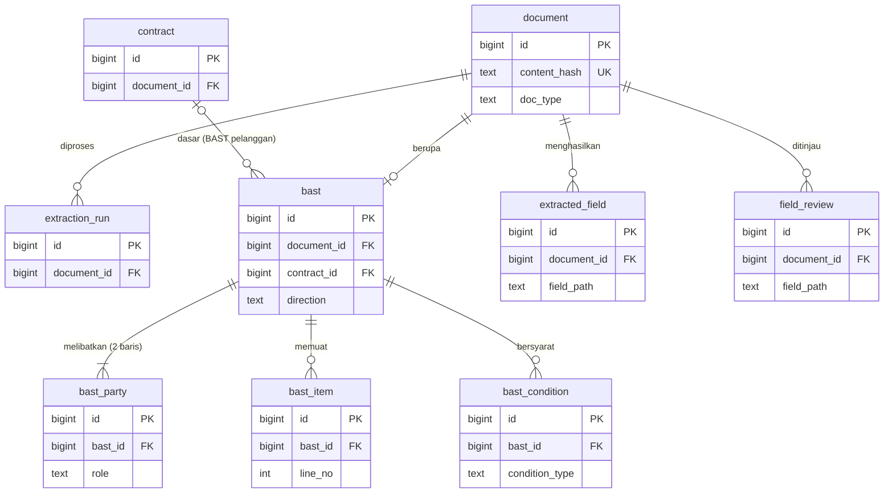

> **Status:** dipindah dari dol-parser (`docs/SKEMA_BAST_NOCODB.md`) pada 2026-10-02 sebagai
> bahan workshop BAST. **Temuan dari 14 BAST (bagian 1–2) tetap berlaku**; rancangan tabel di
> bawahnya sudah dilanjutkan di `dol_schema/model.py` (tabel BAST berstatus ditunda).

# Model Data BAST → NocoDB (companion database)

Dirancang dari **bukti** (14 BAST asli) dan disusun menurut kaidah data engineering, supaya tim AI,
RPA, dan Network memakai **satu kosakata dan satu struktur**. Dokumen ini adalah calon isi repo
`dol-schema` (briefing hlm. 14): sumber kebenaran tunggal untuk bentuk data.

## 1. Bukti: empat bentuk BAST

14 BAST unik dari 16 file (2 duplikat), dibaca langsung.

| Bentuk | Dokumen | Ciri | Siapa "PIHAK PERTAMA" |
|---|---|---|---|
| **A. Format Telkom** | 01 03 08 09 10 11 12 13 (8) | Blok MENYERAHKAN/MENERIMA, **dua nomor BAST**, LAMPIRAN rincian harga | **BUT** (penyerah) |
| **B. Format kampus** | 02 04 07 (3) | 2 hlm: BAST + BA Uji Terima, tanpa nomor BAST | **Pelanggan** (penerima) |
| **C. BAST Vendor** | 06 (1) | Nomor PO/Kontrak, tabel barang, dokumen pendukung DO | **Vendor** (penyerah) |
| **D. Format instansi** | 05 Polda, 14 Lampung (2) | Format milik pelanggan, ada BA Pembayaran | **Pelanggan** (penerima) |

## 2. Frekuensi butir (dasar memilih kolom vs baris)

Sumber: **M** = dibaca manual, **R** = regex atas teks OCR (kurang andal).

| Tier | Butir | Kemunculan | Sumber |
|---|---|---|---|
| **1 — selalu** | Jenis dokumen; nama pekerjaan; penyerah (perusahaan, nama, jabatan); penerima (idem); dokumen dasar (nomor + tanggal) | 14/14 | M |
| **2 — hampir selalu** | Tanggal BAST | ≥11/14 | M |
| | Nilai (Rp) dokumen dasar | ≥11/14 | M |
| | Nomor BAST | 10/14 | M |
| | Tabel barang/pekerjaan · kesimpulan "diterima baik" · BA Uji Terima | ≥11 · 13 · 11 (dari 14) | R |
| **3 — bentuk tertentu** | Progress 100%, layanan aktif sejak, BA Rekonsiliasi Delivery | bentuk A saja | M |
| | Terbilang · alamat pihak · dokumen pendukung DO | 7 · 7 · 1 (dari 14) | R |

## 3. Tiga temuan yang menentukan desain

1. **"Pihak Pertama/Kedua" menunjuk peran yang berbeda antar-bentuk** → model **peran** (`handover`
   / `receiver`), bukan urutan. Skema BAST lama kita terbalik untuk 9 dari 14 dokumen.
2. **Arah BAST dapat diturunkan**: BUT sebagai penyerah → `customer`; BUT sebagai penerima → `vendor`
   (briefing hlm. 10). PM tetap mengonfirmasi.
3. **Dokumen dasar bukan selalu "kontrak"** (kontrak, PKS, SPK, nota pesanan, surat pesanan, PO) →
   perlu kolom jenis, dan acuan kebenarannya beda: BAST Pelanggan → Kontrak/SPK (**data kita**),
   BAST Vendor → PO (**data MyBhakti**, hanya dibaca).

## 4. Kaidah yang dipakai

| Kaidah | Penerapan |
|---|---|
| **Normalisasi (3NF)** | Kelompok kolom berulang (`penyerah_*`, `penerima_*`) dipecah ke tabel `bast_party`. Fakta yang hanya berlaku untuk satu bentuk BAST tidak jadi kolom yang mayoritas kosong. |
| **Kunci** | Kunci pengganti `id` (bigint) + kunci bisnis **UNIQUE** terpisah (`content_hash`). FK selalu bernama `<entitas>_id`. |
| **Satu penulis per tabel** | Mesin menulis tabel data; **hanya manusia menulis `field_review`**. Ini menggantikan kode "buang kolom milik manusia saat update" di klien kita — aturan tidak perlu ditegakkan kode kalau strukturnya sudah memisahkan. |
| **Data mentah vs data bersih** | Nilai apa adanya di dokumen disimpan di kolom `*_text` (bukti, tidak diubah); nilai terparse bertipe DATE/NUMERIC di kolom tanpa akhiran. Parse gagal → kolom bertipe NULL, teks aslinya tetap ada. |
| **Jangan simpan yang bisa dihitung** | Status verifikasi dokumen **tidak** disimpan; dihitung dari `field_review` (view). |
| **Uang** | `numeric(18,2)` + `currency`, tidak pernah float. |
| **Audit** | Setiap tabel: `created_at`, `updated_at` (timestamptz, UTC). |
| **Penamaan** | Nama fisik: bahasa Inggris, `snake_case`, tabel **tunggal**, tanpa singkatan; boolean `is_`/`has_`; tanggal `_date`; waktu `_at`. Istilah domain Indonesia dijaga lewat **glosarium** (bagian 8) dan label tampilan untuk PM. |
| **Batas kepemilikan** (briefing hlm. 7) | Tidak ada tabel klien/vendor/PO. Rujukan ke MyBhakti berupa kolom `*_ref` opak yang diisi n8n — **bukan FK**. |

## 5. ERD

`contract` ditampilkan hanya sebagai target FK; kamus datanya menyusul (di luar lingkup BAST).

## 6. Kamus data

Semua tabel punya `id bigint PK`, `created_at`, `updated_at`. Kolom di bawah adalah tambahannya.

### `document` — setiap berkas yang masuk (supertipe)
| Kolom | Tipe | Null | Keterangan |
|---|---|---|---|
| `content_hash` | text | tidak | sha1 isi berkas. **UNIQUE** — kunci idempotensi |
| `doc_type` | text | tidak | `contract` / `sph` / `bast` |
| `source_filename` | text | tidak | |
| `page_count` | int | ya | |
| `markdown` | text | ya | markdown utuh, agar PM membaca tanpa membuka PDF |

### `extraction_run` — jejak tiap pemrosesan (briefing "Terukur", hlm. 21)
`document_id` FK · `ocr_engine` · `llm_model` · `prompt_version` · `schema_version` ·
`page_count` · `llm_call_count` · `parse_seconds` · `extract_seconds` · `validation_status` · `started_at`.

### `bast` — subtipe 1:1 dengan `document`
| Kolom | Tipe | Null | Keterangan |
|---|---|---|---|
| `document_id` | FK → document | tidak | **UNIQUE** (1:1) |
| `direction` | text | tidak | `customer` / `vendor` / `unknown` |
| `contract_id` | FK → contract | ya | terisi bila `direction = customer` dan kontraknya ada di sistem kita |
| `mybhakti_po_ref` | text | ya | opak, diisi n8n; untuk `direction = vendor` |
| `bast_number_customer` | text | ya | nomor versi pelanggan (mis. `TEL.789/BAST/…`) |
| `bast_number_internal` | text | ya | nomor versi BUT (mis. `702/00/BIS-08/BUT/…`) |
| `handover_date_text` / `handover_date` | text / date | ya | apa adanya / terparse |
| `handover_city` | text | ya | |
| `work_title` | text | tidak | nama pekerjaan |
| `basis_doc_type` | text | ya | `contract` `pks` `spk` `order_note` `purchase_order` `other` |
| `basis_doc_number` | text | ya | nomor **seperti tercetak** |
| `basis_doc_date_text` / `basis_doc_date` | text / date | ya | |
| `basis_doc_value` | numeric | ya | |
| `basis_doc_value_vat` | text | ya | `included` / `excluded` / `unstated` |
| `currency` | char(3) | tidak | default `IDR` |
| `acceptance_statement` | text | ya | mis. "DITERIMA DENGAN HASIL BAIK DAN LENGKAP" |

### `bast_party` — pihak dalam BAST (tepat 2 baris per BAST)
| Kolom | Tipe | Null | Keterangan |
|---|---|---|---|
| `bast_id` | FK → bast | tidak | |
| `role` | text | tidak | `handover` / `receiver`. **UNIQUE (bast_id, role)** |
| `org_name_text` | text | tidak | nama perusahaan **seperti ditandatangani** |
| `signer_name` | text | tidak | |
| `signer_title` | text | ya | |
| `org_address_text` | text | ya | hanya ada di ±7 dari 14 |
| `mybhakti_party_ref` | text | ya | opak, diisi n8n |

Nama dan jabatan disimpan sebagai **cuplikan saat penandatanganan**, bukan dinormalisasi ke tabel
orang/organisasi: jabatan seseorang berubah, tetapi dokumen yang sudah ditandatangani tidak boleh ikut berubah.

### `bast_item` — barang/pekerjaan yang diserahkan
`bast_id` FK · `line_no` int (**UNIQUE (bast_id, line_no)**) · `description` · `quantity` numeric ·
`unit` · `unit_price` numeric · `line_total` numeric · `test_result` · `remarks`.
Harga boleh NULL: bentuk B, C, D tidak memuatnya. `quantity >= 0`, `unit_price >= 0` (CHECK).

### `bast_condition` — fakta jarang muncul, satu fakta per baris
`bast_id` FK · `condition_type` · `value_text` · `value_number` · `value_date`.
`condition_type` bernilai terbatas: `progress_percent` · `service_active_since` ·
`acceptance_test_ref` · `delivery_reconciliation_ref` · `supporting_document` · `amount_in_words`.
Fakta baru = nilai `condition_type` baru, bukan kolom baru.

### `extracted_field` — apa yang mesin baca (ditulis mesin saja)
| Kolom | Tipe | Keterangan |
|---|---|---|
| `document_id` | FK | **UNIQUE (document_id, field_path)** — hanya nilai terbaru |
| `field_path` | text | mis. `bast.work_title`, `bast_party.receiver.signer_name` |
| `ai_value_text` | text | |
| `evidence_page` | int | dihitung deterministik, **bukan** ditulis LLM |
| `evidence_quote` | text | potongan teks OCR yang cocok |
| `evidence_score` | numeric | |
| `system_status` | text | `auto_verified` `auto_accepted` `review_required` `conflict` `missing` |

### `field_review` — keputusan manusia (ditulis PM saja)
| Kolom | Tipe | Keterangan |
|---|---|---|
| `document_id`, `field_path` | FK, text | **UNIQUE (document_id, field_path)** |
| `reviewed_ai_value_text` | text | nilai AI yang **dilihat** PM saat memutuskan |
| `decision` | text | `confirmed` / `corrected` / `rejected` |
| `final_value_text` | text | nilai yang dikunci PM |
| `reviewed_by` | text | |
| `reviewed_at` | timestamptz | |
| `reviewer_note` | text | |

Bila dokumen diproses ulang dan `ai_value_text` baru ≠ `reviewed_ai_value_text`, field itu **perlu
ditinjau ulang** — konfirmasi lama tidak dianggap berlaku untuk nilai yang berbeda.

## 7. Aturan integritas

- **FK `ON DELETE RESTRICT` ke `field_review`**: dokumen yang sudah punya keputusan PM tidak boleh
  terhapus diam-diam. Tabel data mesin boleh `CASCADE`.
- `bast_party`: tepat 2 baris per BAST (satu `handover`, satu `receiver`).
- `bast.direction = 'customer'` ⇒ `mybhakti_po_ref` kosong; `= 'vendor'` ⇒ `contract_id` kosong.
- Status verifikasi dokumen = view: `COUNT(confirmed) / COUNT(field wajib)`; bukan kolom.

## 8. Glosarium (satu persepsi)

| Istilah Indonesia | Nama fisik | Arti |
|---|---|---|
| BAST | `bast` | Berita Acara Serah Terima |
| BAST Pelanggan / Vendor | `direction = customer / vendor` | Kita → pelanggan / vendor → kita |
| pihak yang menyerahkan / menerima | `role = handover / receiver` | **Bukan** "Pihak Pertama/Kedua" |
| dokumen dasar | `basis_doc_*` | Kontrak/SPK/PO yang dirujuk BAST |
| BAUT | `condition_type = acceptance_test_ref` | Berita Acara Uji Terima |
| terkonfirmasi | `field_review.decision` | Sudah diputuskan PM |

## 9. Apa yang berbeda dari draf 4-tabel sebelumnya

Draf sebelumnya (4 tabel) saya buat untuk memangkas kolom. Itu **melanggar** beberapa kaidah:
kolom `penyerah_*`/`penerima_*` adalah kelompok berulang; konfirmasi manusia dan nilai mesin ada di
tabel yang sama; status dokumen disimpan padahal bisa dihitung. Model ini **8 tabel** (sekarang 13),
tiap tabel sederhana dan satu tujuan. Kompleksitas kode ditekan dengan cara lain: DDL dan pemetaan
exporter dibangkitkan dari **satu definisi deklaratif**, bukan ditulis tangan per tabel.

## 10. Yang belum terverifikasi — jangan dianggap pasti

Saya coba membaca dokumentasi NocoDB, tetapi yang terkonfirmasi hanya relasi Has-Many / Belongs-to /
Many-to-Many di UI. **Tidak terkonfirmasi**: (a) apakah relasi itu menjadi FK sungguhan di database,
(b) apakah ada constraint UNIQUE di UI, (c) apakah nama tampilan bisa berbeda dari nama kolom fisik.
Karena itu integritas **tidak boleh bergantung pada NocoDB**. Usul: definisikan tabel dengan SQL DDL di
PostgreSQL (briefing hlm. 13 sudah memakai PostgreSQL) sehingga PK/FK/UNIQUE/CHECK nyata, lalu
hubungkan ke NocoDB sebagai sumber data eksternal. **Uji di instance Anda** bahwa NocoDB membaca FK
dan view dengan benar sebelum memutuskan.

## 11. Batas bukti

- n = 14 dan hampir semuanya dari satu perusahaan (BUT). "Selalu" = 14 dari 14 yang kita punya.
- BAST Vendor hanya 1 dokumen. Tanggal BAST di dokumen 09, 11, 13 tidak terbaca di teks OCR.
